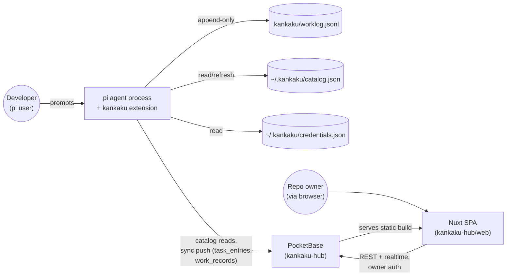
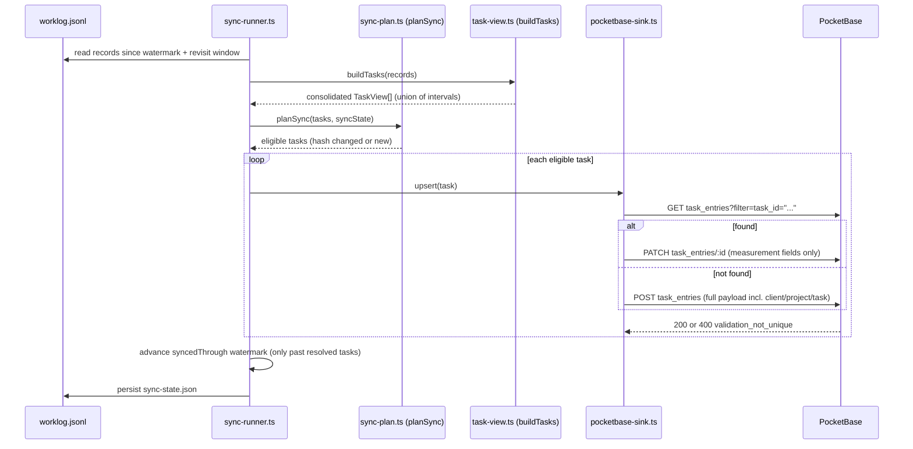
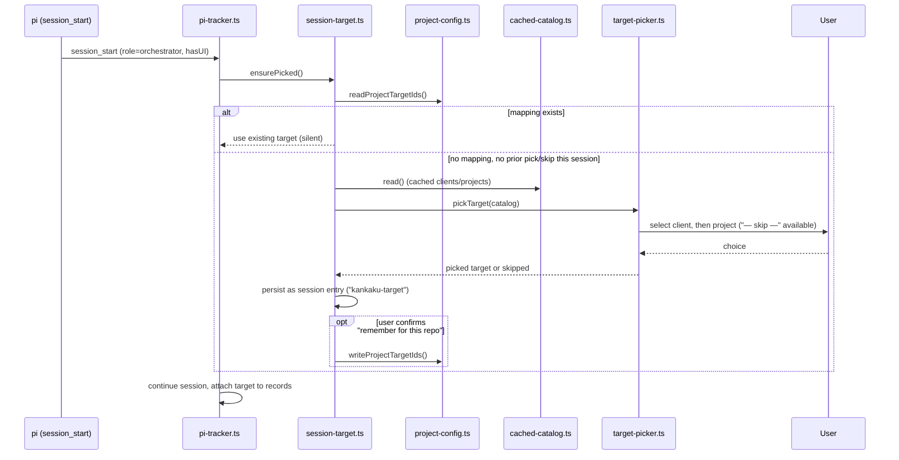
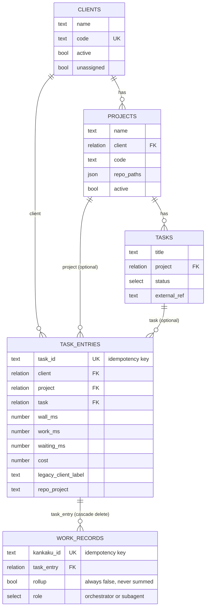

# System overview

Two repos, one system: **kankaku** (a pi extension) writes and syncs work
records; **kankaku-hub** (PocketBase + a Nuxt SPA) holds the canonical
catalog and the synced, consolidated result. See
[ADR 0009](../adr/0009-separate-repos-instead-of-monorepo.md) for why they
are split.

## Components

| Component | Repo | Role |
|---|---|---|
| pi extension | `kankaku` | Records work time/cost per prompt locally; resolves a client/project target; syncs consolidated task rows to the hub. |
| Local JSONL log | `kankaku` (`.kankaku/worklog.jsonl`) | Append-only source of truth for local records — never rewritten. |
| Catalog cache | `kankaku` (`~/.kankaku/catalog.json`) | Local cache of the hub's clients/projects, so session start never blocks on the network. |
| PocketBase | `kankaku-hub` (`pocketbase/`) | Canonical catalog (clients/projects/tasks) + sink for synced `task_entries`/`work_records`. |
| Nuxt SPA | `kankaku-hub` (`web/`) | Dashboard, catalog management, task board, unassigned queue, entries explorer — a read/write view over PocketBase, never a second aggregation engine. |

## Trust boundaries

- **kankaku → PocketBase**: authenticated as a dedicated `role: "service"`
  account, HTTPS only (or `localhost`/`127.0.0.1` for dev) — see
  [`../specs/security-and-privacy.md`](../specs/security-and-privacy.md).
  The service account can write `task_entries`/`work_records` and read
  `clients`/`projects`/`tasks`, but cannot create/update/delete
  clients/projects/tasks.
- **Web → PocketBase**: authenticated as the `role: "owner"` human account
  (or, for local dev, the account created by
  `scripts/create-dev-accounts.sh`). The owner has full catalog write
  access; both roles can write `task_entries`/`work_records`.
- **kankaku's local machine**: `~/.kankaku/credentials.json` (`chmod 600`)
  or `KANKAKU_PB_URL`/`KANKAKU_PB_EMAIL`/`KANKAKU_PB_PASSWORD` env vars hold
  the service account's credentials — never committed to a project repo.
  `<KANKAKU_DIR>/config.json` (frequently committed) holds only ids, never
  credentials.

## System context

## Sync sequence

## Session-start picker sequence

## Data model (ER)

## Related

- [`kankaku-extension.md`](kankaku-extension.md) — kankaku's internal hexagonal layout.
- [`hub-backend.md`](hub-backend.md) — PocketBase schema and access rules in detail.
- [`hub-web.md`](hub-web.md) — the Nuxt SPA in detail.
- [`aggregation.md`](aggregation.md) — the interval-union rule.
- [`../adr/README.md`](../adr/README.md), [`../specs/README.md`](../specs/README.md), [`../phases/README.md`](../phases/README.md)
